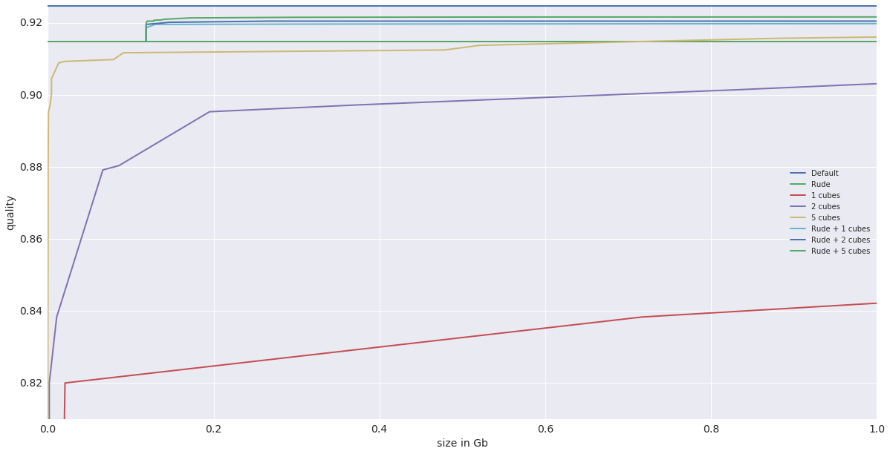

# 1. Введение.
Сегодня машинное обучение (МО) используется в различных сферах: от поиска информации в интернете и распознавания речи до оптимизации состава стали и поиска новой физики.
Практически во всех случаях для решения поставленной задачи очень ограниченны ресурсы (память, процессор, сеть и т.д.). Для многих алгоритмов МО  характерно, что повышение качества модели связанно с повышением уровня потребления ресурсов. Например, при использовании алгоритмов бустинга над деревьями, повышение числа деревьев с десятков до тысяч обычно ведет к значительному росту качества, одновременно увеличивая нагрузку на память и процессор при использовании такой модели. Повышенные требования к аппаратным ресурсам более точных моделей обычно решают за счет различных технических оптимизаций хранения и применения полученной модели: например, с помощью векторных вычислений. Другим подходом является модификация самого процесса обучения, позволяющее получать модели с определенными свойствами, которые позволяют значительно ускорять их применение, не сохраняя необходимый уровень качества.
В данной работе мы рассмотрим модификацию процесса обучения предсказательных моделей алгоритмом MatrixNet [@gulin2011winning], которая позволит ускорить использование модели с сохранением необходимого уровня качества.

# 2. MatrixNet

MatrixNet - является реализацией градиентного бустинга над деревьями, в котором используются так называемые "невнимательные" деревья решений (Oblivious Decision Tree). В данном алгоритме значения каждого признака $i$ разбиваются на корзинки с помощью границ $B_i$. Сами границы определяются заранее с помощью различных статистик.
А исходный вектор с вещественными значениями заменяется на вектор с бинарными значениями $0$ и $1$ ($false$ и $true$): значение $i$-ого признака $f_i$ заменяется на бинарный вектор $g_i$, где $g_{ij} = f_i > B_{ij}$, после чего все $g_i$ конкатенируются в один большой вектор. И в получаемых деревьях вместо сравнения некоторого вещественного признака с некоторым вещественным порогом фактически будет находится сравнение с $0$ и $1$.
В матрикснете можно управлять количеством корзинок, передавая соответствующий параметр при обучении.
Другой достаточно важный параметр - степень регуляризации. Чем он меньше - тем с меньшим вкладом берется каждое новое дерево. Однако, это приходится компенсировать большим количеством деревьев. Данный параметр можно подбирать с помощью кроссвалидации, фиксируя при этом общее количество деревьев.

За основу был взят датасет и модель из [@likhomanenko2015lhcb]. Количество признаков в датасете ~10, модель была обучена на 5000 деревьях с признаком разбиений 64. Очевидное решение исследуемой проблемы: сильно завысить скорость обучения и получить модель с очень небольшим количеством деревьев (меньше 10) хотя и позволяет достичь приемлимой скорости применения, приводит к сильной потери качества.
Модель из данной работы была взята как baseline - именно с ней мы будем сравнивать результаты.

# 3. Гиперкуб

Одним из самых простых способов ускорения является предварительный расчет. Вектор признаков, получаемый после бинаризации, принимает ограниченное число значений. Поэтому мы можем предпосчитать ответ для всех таких значений.

Пусть $n$ - количество признаков. Рассмотрим некоторую обученную с помощью некоторого алгоритма модель $Z$, содержащую множество деревьев $T$. Для удобства будем считать, что значения всех признаков лежат в отрезке $[0,1]$.
Пусть $B_i$ - набор границ корзинок для $i$'ого признака, которые использовались внутри набора $T$. Тогда с помощью плоскостей $X_i$ = $B_{ij}$ для всех $i,j$ мы можем разбить гиперкуб $[0;1]$ на небольшие гиперпараллелепипеды. Очевидно, что внутри каждого гиперпараллелепипеда предсказание модели будет постоянным.
По сути, модель $Z$ позволяет посчитать значение в любой точке нашего гиперкуба. Однако, если мы предпосчитаем значение в каждом кусочке, то мы ускорим применение нашей модели, сведя её лишь к определению нужного кусочка. Асимптотическая сложность применения модели из деревьев - $O(h \cdot t)$, где $h$ - высота деревьев, $t$ - общее количество деревьев. Асимптотическая сложность предпосчитанная сложность гиперкуба же - $O(n \cdot log(b))$, где $n$ - число признаков, а $b$ - количество разрезов одного признака (такая сложность достигается с помощью использования бинарного поиска). При малом количестве признаков такой гиперкуб может применяться значительно быстрее.
Однако, для хранения такого гиперкуба нужно порядка $O(b^n)$ памяти, что может быть слишком большим. Поэтому использовать предпосчитанный гиперкуб можно лишь при небольших $b$ и $n$.
Рассмотрим случае при малых n. Получить небольшое $b$ мы можем двумя основными способами: ограничить число разрезов для каждого признака - тогда мы сможем обучить MatrixNet с $t=5000$, либо сильно ограничить число деревьев - тогда общее количество действительно используемых разрезов будет ровно $h \cdot t$ без учета повторных использований одних и тех же разрезов.
В работе [@likhomanenko2015lhcb] использовался первый способ: был обучен и превращен в "гиперкуб" MatrixNet с небольшим количеством разрезов.
Потребление памяти у одного гиперкуба может быть чрезвычайно огромным при условии достижения приемлимого качества, поэтому естественным продолжением является построение несколько гиперкубов.

# 4. Задача многокритериальной оптимизации

Таким образом, целевыми метриками является $Q$ (качество модели), $S$ (размер) и $M$ (количество гиперкубов). Конечно, нас скорее интересует время применения такой модели, однако можно считать, что время работы прямо пропорционально количеству гиперкубов.
Входной же вектор должен будет описывать алгоритм получения деревьев и алгоритм объединения их в кубы. Обозначим его $V$. Тогда мы решаем следующую задачу:

min{$Q$($V$), $S$($V$), $M$($V$)} по всем возможным $V$.

Прежде чем мы приступим к рассмотрению содержимого вектора $X$, необходимо отметить, что для практического применения данную задачу можно решать с помощью метода ограничений: обычно на практике есть довольно строгие ограничения на размер модели и доступное время применения.

# 5. Алгоритм объединения набора деревьев в несколько гиперкубов.

Допустим, у нас есть $N$ деревьев и мы хотим объединить их в $M$ гиперкубов. При $M=1$ задача тривиальна и рассматривалась выше. Рассмотрим $M > 1$. Метрикой оптимальности разбиения будем считать занимаемую память.

<Надо продумать разумное математическое обозначение и сформулировать оптимальность разбиения через формулы.>
В общем случае, это непростая задача и она требует отдельного изучения. Мы же использовали несколько эвристических методов:
  1) Вначале у нас $N$ гиперкубов из $1$ дерева. На каждой итерации находим и сливаем два наиболее схожих гиперкуба (схожих - то есть итоговая метрика вырастет слабее всего)
  2) Вначале у нас $M$ гиперкубов и в каждом одно произвольно выбранное дерево. Выбираем любое из оставшихся деревьев и добавляем в наиболее схожий с ним гиперкуб
  3) Аналогично 2-ому, но выбираем самое лучшее дерево.
Эти методы, очевидно, не дают гарантированно лучшего варианта, но позволяют получить вариант, который лучше случайного разбиения. Мы в итоге брали самый лучший из вариант из всех трех.

# 6. Алгоритм обучения подходящих деревьев.

У MatrixNet есть несколько ключевых входных параметров:
  1) Способ бинаризации факторов
  2) Целевое число деревьев ($T$)
  3) Степень регуляризации ($W$)
Однако, мы не стали оптимизировать по всем возможным способам разбиения, перебирая лишь параметр фактор бинаризации $X$ у встроенного в MatrixNet алгоритма. В целом, вместо MatrixNet можно использовать любой другой алгоритм обучения деревьев.

Опять же, мы уменьшаем исследуемое пространство следующим соображением: размер куба пропорционален произведению количества используемых бинов у каждой фичи. А значит, если мы хотим получать малые кубы, то итоговое множество деревьев должно использовать малое количество бинов. Тут есть два ключевых подхода:
  1) Фиксируем очень грубое разбиение с малым количеством кубов и обучаем сколь угодно большое количество деревьев.
  2) Разбиение делаем достаточно детальное, но при этом значительно уменьшаем количество обученных деревьев, тем самым снижая количество реально используемых бинов.

При внедрении на LHCb модели, обученной Matrixnet'ом мы использовали первый подход. В этой работе мы пробуем применить второй подход и скомбинировать его с первым. Так у нас получились такие способы обучения деревьев:
  1) "Rude": очень небольшой $X$, большое $T$. На выходе получается из-за небольшого $X$ все деревья можно объединить в большой гиперкуб.
  2) "Small": большой $X$, небольшое $T$. Из-за большого $X$ деревья получаются очень разные и значительно хуже склеиваются, из-за чего приходится сильно ограничивать число деревьев, используемых для склейки в гиперкубы.
  3) Комбинированный: обучаем Small по бейзлайну Rude и берем все получившиеся гиперкубы в одну модель.

# 7. Решение оптимизационной задачи

Как было сказано выше, мы решали оптимизационную задачу с ограничениями, фиксируя разные значения $S$ и $M$ (при этом глобально $S$ ограничен 1gb, а $M$ < 5). Для каждого случая мы сравнивали между собой все три способа получения деревьев, а так же сравнивали с эталонным решением: оптимальным образом обученный MatrixNet без каких либо ограничений.

  1) В качестве эталонного решения был взят MatrixNet с $T = 5000$, $X = 64$ и оптимальным $W$.
  2) Rude - мы сохранили $T = 5000$ от эталона, однако взяли $X = 5$ - это максимальное $X$, при котором получаемый гиперкуб укладывается в 1GB.
  3) Small - $W$ и $T$ мы перебирали поиском по сетке. Фактически количество деревьев не превышало 100. При большем значении либо получалось слишком много гиперкубов, либо слишком большой размер. Полученные деревья мы разбивали в кубы, опираясь на текущее значение $M$. В качестве фактора разбиения мы брали $X = 64$ (как у эталона).
  4) Комбинированный подход объединяет пункты 2 и 3.

# 8. Обсуждение.
На графике 1 представлены результаты. По оси x указано ограничение на суммарный размер модели S, а по оси y - итоговое качество модели Q.

  1) Baseline - обычный MatrixNet с $T = 5000$, $X = 64$, изображен линией для удобства, хотя потребление памяти у обычной модели очень мало
  2) Rude - при $T = 5000$, $X = 5$
  3) Small - при $T < 100$, $X = 64$ при различных $M$.
  4) Rude + Small
По графику видно, что способ 4 дает наибольшее итогое качество. Таким образом итого можно порекомендовать в качестве первого гиперкуба брать rude схему, а при недостаточном качестве добавлять Small гиперкубы, полученные из MatrixNet, обученного на небольшом количестве деревьев.

Стоит отметить, что при малом X MatrixNet строит не самые лучшие разбиения признаков. Поэтому в дальнейших исследованиях необходимо рассмотреть способы нахождения более оптимальных разбиений, чем получается с помощью простых статистических методов.

# 9. Заключение.

(_TODO_: написать)

# Ссылки
