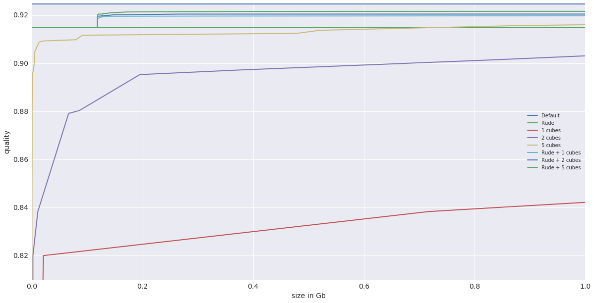
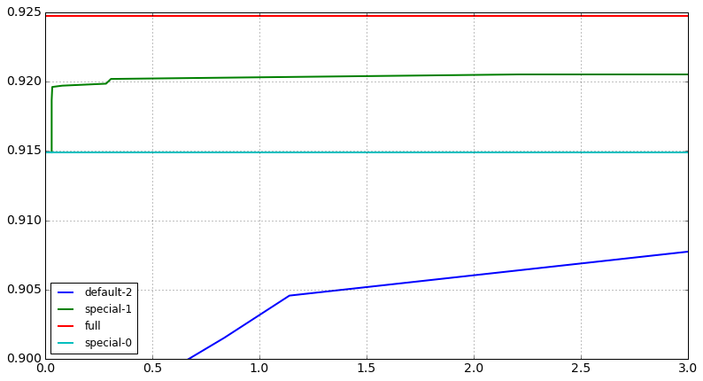
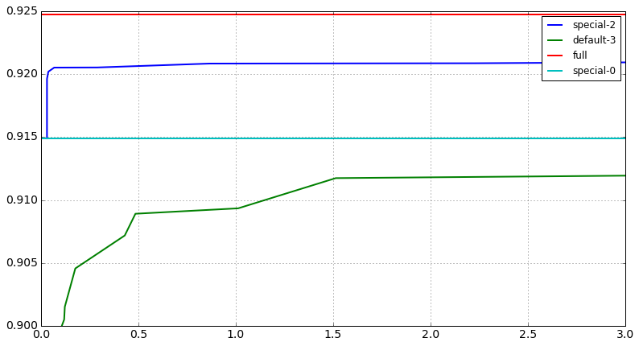
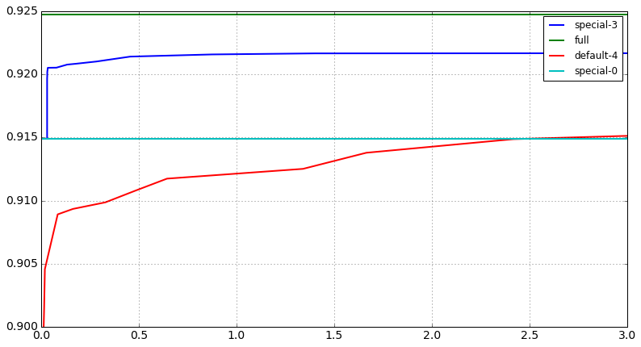
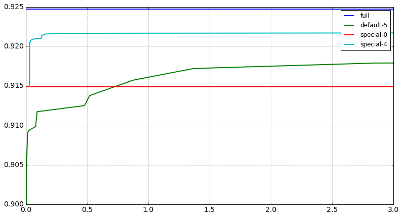

```python
import seaborn
```

    /root/miniconda/envs/rep_py2/lib/python2.7/site-packages/IPython/html.py:14: ShimWarning: The `IPython.html` package has been deprecated. You should import from `notebook` instead. `IPython.html.widgets` has moved to `ipywidgets`.
      "`IPython.html.widgets` has moved to `ipywidgets`.", ShimWarning)


```python
%run additional.ipynb
```


```python
%pylab inline
```

    Populating the interactive namespace from numpy and matplotlib


    /root/miniconda/envs/rep_py2/lib/python2.7/site-packages/IPython/core/magics/pylab.py:161: UserWarning: pylab import has clobbered these variables: ['empty']
    `%matplotlib` prevents importing * from pylab and numpy
      "\n`%matplotlib` prevents importing * from pylab and numpy"


```python
pandas.set_option('display.max_colwidth', 120)
```

# HLT2 nbody classification

did preselections:

* any sv.n, 
* any sv.minpt
* sv.nlt16 < 2

## Training channels (read data)

We will use just 11114001, 11296013, 11874042, 12103035, 13246001, 13264021


```python
sig_train_modes_names = [11114001, 11296013, 11874042, 12103035, 13246001, 13264021]
bck_train_mode_name = 30000000
sig_train_files = ['mod_{}.csv'.format(name) for name in sig_train_modes_names]
bck_train_files = 'mod_30000000.csv'
folder = "prepared_hlt_body/"
```


```python
# concat all signal data
if not os.path.exists(folder + 'signal_hlt2.csv'):
    concat_files(folder, sig_train_files, os.path.join(folder , 'signal_hlt2.csv'))
```


```python
signal_data = pandas.read_csv(os.path.join(folder , 'signal_hlt2.csv'), sep='\t')
bck_data = pandas.read_csv(os.path.join(folder , bck_train_files), sep='\t')
```


```python
signal_data.columns
```


    Index([u'unique', u'mode', u'event_number', u'sv_number', u'pass_2body',
           u'pass_nbody', u'signal', u'sumpt', u'm', u'mcor', u'ipchi2', u'chi2',
           u'sumipchi2', u'fdr', u'nlt16', u'minpt', u'eta', u'pt', u'nmu', u'n',
           u'fdchi2', u'maxtchi2', u'ngood', u'nmu1', u'mupt', u'n1trk', u'sig',
           u'idx'],
          dtype='object')


## Counting events and svrs,
that passed **L0** and **GoodGenB** preselection (this data was generated by skim)


```python
print 'Signal', statistic_length(signal_data)
print 'Bck', statistic_length(bck_data)
```

    Signal {'SVR': 12367085, 'Events': 166059}
    Bck {'SVR': 408147, 'Events': 38035}


```python
total_bck_events = statistic_length(bck_data)['Events'] + empty_events[bck_train_mode_name]
total_signal_events_by_mode = dict()
for mode in sig_train_modes_names:
    total_signal_events_by_mode[mode] = statistic_length(signal_data[signal_data['mode'] == mode])['Events'] + empty_events[mode]
```

### events distribution by mode


```python
print 'Bck:', total_bck_events
'Signal:', total_signal_events_by_mode
```

    Bck: 111306


    ('Signal:',
     {11114001: 61102,
      11296013: 17149,
      11874042: 3942,
      12103035: 25250,
      13246001: 37313,
      13264021: 25165})


## Define variables

We will use two sets of variables


```python
variables = ["n", "mcor", "chi2", "eta", "fdchi2", "minpt", "nlt16", "ipchi2", "n1trk"] + ["sumpt"]
```

## Counting events and svrs,

which passed **pass_nbody** (equivalent Mike's preselections for nbody selection)


```python
# hlt2 nbody selection
signal_data = signal_data[(signal_data['pass_nbody'] == 1) & (signal_data['mcor'] <= 10e3)]
bck_data = bck_data[(bck_data['pass_nbody'] == 1) & (bck_data['mcor'] <= 10e3)]
```


```python
print 'Signal', statistic_length(signal_data)
print 'Bck', statistic_length(bck_data)
```

    Signal {'SVR': 960600, 'Events': 150566}
    Bck {'SVR': 21868, 'Events': 9664}


```python
total_signal_events_by_mode_presel = dict()
for mode in sig_train_modes_names:
    total_signal_events_by_mode_presel[mode] = statistic_length(signal_data[signal_data['mode'] == mode])['Events']
total_bck_events_presel = statistic_length(bck_data)['Events']
```

### events distribution by mode


```python
print 'Bck:', total_bck_events_presel
'Signal:', total_signal_events_by_mode_presel
```

    Bck: 9664


    ('Signal:',
     {11114001: 53105,
      11296013: 16256,
      11874042: 3290,
      12103035: 21498,
      13246001: 33807,
      13264021: 22610})


```python
signal_data.head()
```


<div>
<table border="1" class="dataframe">
  <thead>
    <tr style="text-align: right;">
      <th></th>
      <th>unique</th>
      <th>mode</th>
      <th>event_number</th>
      <th>sv_number</th>
      <th>pass_2body</th>
      <th>pass_nbody</th>
      <th>signal</th>
      <th>sumpt</th>
      <th>m</th>
      <th>mcor</th>
      <th>...</th>
      <th>nmu</th>
      <th>n</th>
      <th>fdchi2</th>
      <th>maxtchi2</th>
      <th>ngood</th>
      <th>nmu1</th>
      <th>mupt</th>
      <th>n1trk</th>
      <th>sig</th>
      <th>idx</th>
    </tr>
  </thead>
  <tbody>
    <tr>
      <th>1</th>
      <td>11114001_0</td>
      <td>11114001</td>
      <td>0</td>
      <td>1</td>
      <td>1</td>
      <td>1</td>
      <td>1</td>
      <td>6912.10</td>
      <td>2806.110</td>
      <td>4168.77</td>
      <td>...</td>
      <td>1</td>
      <td>2</td>
      <td>9653.910</td>
      <td>1.20832</td>
      <td>2</td>
      <td>1</td>
      <td>2972.750</td>
      <td>2</td>
      <td>1</td>
      <td>1</td>
    </tr>
    <tr>
      <th>2</th>
      <td>11114001_0</td>
      <td>11114001</td>
      <td>0</td>
      <td>2</td>
      <td>1</td>
      <td>1</td>
      <td>1</td>
      <td>3731.68</td>
      <td>728.895</td>
      <td>4429.24</td>
      <td>...</td>
      <td>2</td>
      <td>2</td>
      <td>7424.620</td>
      <td>1.58733</td>
      <td>2</td>
      <td>2</td>
      <td>2972.750</td>
      <td>1</td>
      <td>1</td>
      <td>2</td>
    </tr>
    <tr>
      <th>3</th>
      <td>11114001_0</td>
      <td>11114001</td>
      <td>0</td>
      <td>3</td>
      <td>1</td>
      <td>1</td>
      <td>1</td>
      <td>4698.27</td>
      <td>1249.280</td>
      <td>2144.50</td>
      <td>...</td>
      <td>1</td>
      <td>2</td>
      <td>1382.720</td>
      <td>1.58733</td>
      <td>2</td>
      <td>1</td>
      <td>758.924</td>
      <td>1</td>
      <td>1</td>
      <td>3</td>
    </tr>
    <tr>
      <th>5</th>
      <td>11114001_1</td>
      <td>11114001</td>
      <td>1</td>
      <td>1</td>
      <td>1</td>
      <td>1</td>
      <td>1</td>
      <td>4003.36</td>
      <td>3530.930</td>
      <td>4651.29</td>
      <td>...</td>
      <td>1</td>
      <td>2</td>
      <td>1102.850</td>
      <td>1.20808</td>
      <td>2</td>
      <td>1</td>
      <td>2611.970</td>
      <td>2</td>
      <td>1</td>
      <td>1</td>
    </tr>
    <tr>
      <th>9</th>
      <td>11114001_1</td>
      <td>11114001</td>
      <td>1</td>
      <td>5</td>
      <td>1</td>
      <td>1</td>
      <td>1</td>
      <td>2145.67</td>
      <td>1520.500</td>
      <td>2266.15</td>
      <td>...</td>
      <td>1</td>
      <td>2</td>
      <td>868.049</td>
      <td>1.35907</td>
      <td>2</td>
      <td>1</td>
      <td>1137.010</td>
      <td>2</td>
      <td>1</td>
      <td>5</td>
    </tr>
  </tbody>
</table>
<p>5 rows × 28 columns</p>
</div>


## Prepare train/test splitting

Divide events which passed alll preselections into two equal parts randomly


```python
ds_train_signal, ds_train_bck, ds_test_signal, ds_test_bck = prepare_data(signal_data, bck_data, 'unique')
```

### train: counting events and svrs


```python
print 'Signal', statistic_length(ds_train_signal)
print 'Bck', statistic_length(ds_train_bck)
```

    Signal {'SVR': 479851, 'Events': 75283}
    Bck {'SVR': 10759, 'Events': 4832}


```python
train = pandas.concat([ds_train_bck, ds_train_signal])
```

### test: counting events and svrs


```python
print 'Signal', statistic_length(ds_test_signal)
print 'Bck', statistic_length(ds_test_bck)
```

    Signal {'SVR': 480749, 'Events': 75283}
    Bck {'SVR': 11109, 'Events': 4832}


```python
test = pandas.concat([ds_test_bck, ds_test_signal])
```

## Define all total events in test samples
(which passed just l0 and goodgenB) using also empty events. Suppose that events which didn't pass **pass_nboby** also were equal randomly divided into training and test samples 


```python
total_test_bck_events = (total_bck_events - total_bck_events_presel) // 2 + statistic_length(ds_test_bck)['Events']
total_test_signal_events = dict()
for mode in sig_train_modes_names:
    total_not_passed_signal = total_signal_events_by_mode[mode] - total_signal_events_by_mode_presel[mode]
    total_test_signal_events[mode] = total_not_passed_signal // 2 + \
        statistic_length(ds_test_signal[ds_test_signal['mode'] == mode])['Events']
```


```python
print 'Bck total test events:', total_test_bck_events
'Signal total test events:', total_test_signal_events
```

    Bck total test events: 55653


    ('Signal total test events:',
     {11114001: 30533,
      11296013: 8630,
      11874042: 1950,
      12103035: 12682,
      13246001: 18627,
      13264021: 12537})


# Matrixnet training

----

### Default


```python
from rep.estimators.utils import proba_to_score
from rep_ef.estimators import MatrixNetClassifier
```


```python
import cPickle
default_matrixnet = None
if os.path.exists('baseline-models/hlt2_default_matrixnet.pkl'):
    with open('baseline-models/hlt2_default_matrixnet.pkl', 'r') as file_mn:
        default_matrixnet = cPickle.load(file_mn)
```


```python
from rep_ef.estimators import MatrixNetClassifier
```


```python
default_params = {"connection_url": 'url', "connection_token": 'token', "train_features": variables, 'sync': False}
# weight = numpy.ones(len(train))
# weight[train.signal.values == 0] = sum(train.signal == 1) * 1. / sum(train.signal == 0)
default_matrixnet = MatrixNetClassifier(iterations=5000, regularization=0.02, **default_params)
%time default_matrixnet.fit(train, train['signal'])
```

    CPU times: user 4.4 s, sys: 192 ms, total: 4.6 s
    Wall time: 5.38 s


    MatrixNetClassifier(auto_stop=None, baseline_feature=None,
              command_line_params=None, connection_token='token',
              connection_url='url', dump_filename=None,
              features_sample_rate_per_iteration=1.0, intervals=64,
              iterations=5000, max_features_per_iteration=6,
              regularization=0.02, sync=False,
              train_features=['n', 'mcor', 'chi2', 'eta', 'fdchi2', 'minpt', 'nlt16', 'ipchi2', 'n1trk', 'sumpt'],
              training_fraction=0.5)


```python
import cPickle
import os
with open('baseline-models/hlt2_default_matrixnet.pkl', 'w') as file_mn:
    cPickle.dump(default_matrixnet, file_mn)
```


```python
import cPickle
from rep.metaml import ClassifiersFactory
default_matrixnet_factory = ClassifiersFactory()
if os.path.exists('baseline-models/hlt2_default_factory.pkl'):
    with open('baseline-models/hlt2_default_factory.pkl', 'r') as file_mn:
        default_matrixnet_factory = cPickle.load(file_mn)
```


```python
for r in (0.001, 0.002, 0.005, 0.007, 0.01, 0.02, 0.05):
    default_matrixnet_factory.add_classifier("default-%lf" % r, MatrixNetClassifier(iterations=5000, regularization=r, **default_params))
    
for r in [0.07, 0.1, 0.2, 0.5, 0.7, 1]:
    for i in [10, 20, 30, 50]:
        default_matrixnet_factory.add_classifier("default-small-%d-%lf" % (i, r), MatrixNetClassifier(iterations=i, regularization=r, **default_params))
%time default_matrixnet_factory.fit(train, train['signal'])


with open('baseline-models/hlt2_default_factory.pkl', 'w') as file_mn:
    cPickle.dump(default_matrixnet_factory, file_mn)
```

    model default-0.001000 was trained in 5.13 seconds
    model default-0.002000 was trained in 4.99 seconds
    model default-0.005000 was trained in 5.26 seconds
    model default-0.007000 was trained in 4.99 seconds
    model default-0.010000 was trained in 5.00 seconds
    model default-0.020000 was trained in 5.01 seconds
    model default-0.050000 was trained in 5.03 seconds
    model default-small-10-0.070000 was trained in 5.00 seconds
    model default-small-20-0.070000 was trained in 5.01 seconds
    model default-small-30-0.070000 was trained in 4.99 seconds
    model default-small-50-0.070000 was trained in 5.08 seconds
    model default-small-10-0.100000 was trained in 5.13 seconds
    model default-small-20-0.100000 was trained in 4.98 seconds
    model default-small-30-0.100000 was trained in 4.99 seconds
    model default-small-50-0.100000 was trained in 5.12 seconds
    model default-small-10-0.200000 was trained in 5.01 seconds
    model default-small-20-0.200000 was trained in 5.05 seconds
    model default-small-30-0.200000 was trained in 5.02 seconds
    model default-small-50-0.200000 was trained in 4.97 seconds
    model default-small-10-0.500000 was trained in 4.95 seconds
    model default-small-20-0.500000 was trained in 4.96 seconds
    model default-small-30-0.500000 was trained in 5.00 seconds
    model default-small-50-0.500000 was trained in 5.18 seconds
    model default-small-10-0.700000 was trained in 5.20 seconds
    model default-small-20-0.700000 was trained in 5.01 seconds
    model default-small-30-0.700000 was trained in 5.04 seconds
    model default-small-50-0.700000 was trained in 5.04 seconds
    model default-small-10-1.000000 was trained in 5.02 seconds
    model default-small-20-1.000000 was trained in 4.99 seconds
    model default-small-30-1.000000 was trained in 5.14 seconds
    model default-small-50-1.000000 was trained in 5.04 seconds
    Totally spent 156.34 seconds on training
    CPU times: user 2min 12s, sys: 5.28 s, total: 2min 18s
    Wall time: 2min 36s


### Train matrixnets with few borders


```python
import cPickle
from rep.metaml import ClassifiersFactory
border_factory = ClassifiersFactory()
if os.path.exists('baseline-models/hlt2_border_factory.pkl'):
    with open('baseline-models/hlt2_border_factory.pkl', 'r') as file_mn:
        border_factory = cPickle.load(file_mn)
```


```python
special_b = {
    'n': [2.5, 3.5],
    'mcor': [2000,3000,4000,5000,7500],  # I want to remove splits too close the the B mass as I was looking in simulation and this could distort the mass peak (possibly)
    'chi2': [1,2.5,5,7.5,10,100],  # I also propose we add a cut to the pre-selection of chi2 < 1000.  I don't want to put in splits at too small values here b/c these type of inputs are never modeled quite right in the simulation (they always look a bit more smeared in data).
    'sumpt': [3000,4000,5000,6000,7500,9000,12e3,23e3,50e3],  # I am happy with the MN splits here (these are almost "as is" from modify-6)
    'eta': [2.5,3,3.75,4.25,4.5], # Close to MN.  
    'fdchi2': [33,125,350,780,1800,5000,10000],  # I want to make the biggest split 10e3 because in the simulated events there is pretty much only BKGD above 40e3 but we don't want the BDT to learn to kill these as new particles would live here.   Otherwise I took the MN splits and modified the first one (the first one is 5sigma now).
    'minpt': [350,500,750,1500,3000,5000],   # let's make 500 the 2nd split so that this lines up with the HLT1 SVs.
    'nlt16': [0.5],
    'ipchi2': [8,26,62,150,500,1000],  # I also propose we add a cut of IP chi2 < 5000 as it's all background out there.  
    'n1trk': [0.5, 1.5, 2.5, 3.5]
}
```


```python
for interval in (4, 5, 6, 7):
    border_factory.add_classifier("borders-%d" % interval, MatrixNetClassifier(iterations=5000, regularization=0.02, intervals=interval, **default_params))

border_factory.add_classifier("borders-special", MatrixNetClassifier(iterations=5000, regularization=0.02, intervals=special_b, **default_params))
border_factory.fit(train, train['signal'])
```

    model borders-4    was trained in 5.03 seconds
    model borders-5    was trained in 5.04 seconds
    model borders-6    was trained in 5.02 seconds
    model borders-7    was trained in 5.25 seconds
    model borders-special was trained in 5.66 seconds
    Totally spent 26.00 seconds on training


    ClassifiersFactory([('borders-4',
                         MatrixNetClassifier(auto_stop=None, baseline_feature=None,
                                   command_line_params=None, connection_token='token',
                                   connection_url='url', dump_filename=None,
                                   features_sample_rate_per_iteration=1.0, intervals=4,
                                   iterations=5000, max_features_per_iteration=6,
                                   regularization=0.02, sync=False,
                                   train_features=['n', 'mcor', 'chi2', 'eta', 'fdchi2', 'minpt', 'nlt16', 'ipchi2', 'n1trk', 'sumpt'],
                                   training_fraction=0.5)),
                        ('borders-5',
                         MatrixNetClassifier(auto_stop=None, baseline_feature=None,
                                   command_line_params=None, connection_token='token',
                                   connection_url='url', dump_filename=None,
                                   features_sample_rate_per_iteration=1.0, intervals=5,
                                   iterations=5000, max_features_per_iteration=6,
                                   regularization=0.02, sync=False,
                                   train_features=['n', 'mcor', 'chi2', 'eta', 'fdchi2', 'minpt', 'nlt16', 'ipchi2', 'n1trk', 'sumpt'],
                                   training_fraction=0.5)),
                        ('borders-6',
                         MatrixNetClassifier(auto_stop=None, baseline_feature=None,
                                   command_line_params=None, connection_token='token',
                                   connection_url='url', dump_filename=None,
                                   features_sample_rate_per_iteration=1.0, intervals=6,
                                   iterations=5000, max_features_per_iteration=6,
                                   regularization=0.02, sync=False,
                                   train_features=['n', 'mcor', 'chi2', 'eta', 'fdchi2', 'minpt', 'nlt16', 'ipchi2', 'n1trk', 'sumpt'],
                                   training_fraction=0.5)),
                        ('borders-7',
                         MatrixNetClassifier(auto_stop=None, baseline_feature=None,
                                   command_line_params=None, connection_token='token',
                                   connection_url='url', dump_filename=None,
                                   features_sample_rate_per_iteration=1.0, intervals=7,
                                   iterations=5000, max_features_per_iteration=6,
                                   regularization=0.02, sync=False,
                                   train_features=['n', 'mcor', 'chi2', 'eta', 'fdchi2', 'minpt', 'nlt16', 'ipchi2', 'n1trk', 'sumpt'],
                                   training_fraction=0.5)),
                        ('borders-special',
                         MatrixNetClassifier(auto_stop=None, baseline_feature=None,
                                   command_line_params=None, connection_token='token',
                                   connection_url='url', dump_filename=None,
                                   features_sample_rate_per_iteration=1.0,
                                   intervals={'sumpt': [3000, 4000, 5000, 6000, 7500, 9000, 12000.0, 23000.0, 50000.0], 'eta': [2.5, 3, 3.75, 4.25, 4.5], 'minpt': [350, 500, 750, 1500, 3000, 5000], 'chi2': [1, 2.5, 5, 7.5, 10, 100], 'n1trk': [0.5, 1.5, 2.5, 3.5], 'nlt16': [0.5], 'mcor': [2000, 3000, 4000, 5000, 7500], 'fdchi2': [33, 125, 350, 780, 1800, 5000, 10000], 'ipchi2': [8, 26, 62, 150, 500, 1000], 'n': [2.5, 3.5]},
                                   iterations=5000, max_features_per_iteration=6,
                                   regularization=0.02, sync=False,
                                   train_features=['n', 'mcor', 'chi2', 'eta', 'fdchi2', 'minpt', 'nlt16', 'ipchi2', 'n1trk', 'sumpt'],
                                   training_fraction=0.5))])


```python
import cPickle
with open('baseline-models/hlt2_border_factory.pkl', 'w') as file_mn:
    cPickle.dump(border_factory, file_mn)
```

### Predict baseline


```python
train_columns = border_factory.predict_proba(train)
test_columns = border_factory.predict_proba(test)
```


    

    KeyboardInterruptTraceback (most recent call last)

    <ipython-input-62-6672861c4886> in <module>()
    ----> 1 train_columns = border_factory.predict_proba(train)
          2 test_columns = border_factory.predict_proba(test)


    /root/miniconda/envs/rep_py2/lib/python2.7/site-packages/rep/metaml/factory.pyc in predict_proba(self, X, parallel_profile)
        170         :rtype: OrderedDict[numpy.array of shape [n_samples] with float predictions]
        171         """
    --> 172         return self._predict_method(X, parallel_profile=parallel_profile, prediction_type='classification-proba')
        173 
        174     def _predict_method(self, X, parallel_profile=None, prediction_type='classification'):


    /root/miniconda/envs/rep_py2/lib/python2.7/site-packages/rep/metaml/factory.pyc in _predict_method(self, X, parallel_profile, prediction_type)
        187         start_time = time.time()
        188         result = utils.map_on_cluster(parallel_profile, predict_estimator, list(self.keys()), list(self.values()), [X] * len(self),
    --> 189                                       [prediction_type] * len(self))
        190 
        191         for status, data in result:


    /root/miniconda/envs/rep_py2/lib/python2.7/site-packages/rep/metaml/utils.pyc in map_on_cluster(parallel_profile, *args, **kw_args)
         46     """
         47     if parallel_profile is None:
    ---> 48         return map(*args)
         49     elif str.startswith(parallel_profile, 'threads-'):
         50         n_threads = int(parallel_profile[len('threads-'):])


    /root/miniconda/envs/rep_py2/lib/python2.7/site-packages/rep/metaml/factory.pyc in predict_estimator(name, estimator, X, prediction_type)
        356             prediction = estimator.predict(X)
        357         elif prediction_type == 'classification-proba':
    --> 358             prediction = estimator.predict_proba(X)
        359         elif prediction_type == 'regression':
        360             prediction = estimator.predict(X)


    /root/miniconda/envs/rep_py2/lib/python2.7/site-packages/rep_ef-0.6.4-py2.7.egg/rep_ef/estimators/matrixnet.pyc in predict_proba(self, X)
        425         if self.n_classes_ == 2:
        426             if baseline is None:
    --> 427                 return score_to_proba(mx.apply(data))
        428             else:
        429                 return score_to_proba(baseline + mx.apply(data))


    /root/miniconda/envs/rep_py2/lib/python2.7/site-packages/rep_ef-0.6.4-py2.7.egg/rep_ef/estimators/_matrixnetapplier.pyc in apply(self, events)
        172         result = numpy.zeros(len(events), dtype=float)
        173         for stage_predictions in self.apply_separately(events):
    --> 174             result += stage_predictions
        175         return result
        176 


    KeyboardInterrupt: 


```python
for key, values in train_columns.iteritems():
    train[key] = proba_to_score(values)
for key, values in test_columns.iteritems():
    test[key] = proba_to_score(values)
```

### Experiments with bordering


```python
import os
from rep.metaml import ClassifiersFactory
small_factory = ClassifiersFactory()
import cPickle
if os.path.exists('baseline-models/hlt2_cube_mxs.pkl'):
    with open('baseline-models/hlt2_cube_mxs.pkl', 'r') as file_mn:
        small_factory = cPickle.load(file_mn)
default_params = {"connection_url": 'url', "connection_token": 'token', "train_features": variables, 'sync': False}
```


```python
for r in [0.01, 0.02, 0.05, 0.07, 0.1, 0.2, 0.5, 0.7, 1, 2]:
    small_factory.add_classifier("default-small-%lf" % r, MatrixNetClassifier(iterations=100, regularization=r, **default_params))
    small_factory.add_classifier("special-border-%lf" % r, MatrixNetClassifier(iterations=100, regularization=r, baseline_feature="borders-special", **default_params))
%time small_factory.fit(train, train['signal'])
for key in small_factory.keys():
    small_factory[key].synchronize()
import cPickle
with open('baseline-models/hlt2_cube_mxs.pkl', 'w') as file_mn:
    cPickle.dump(small_factory, file_mn)

```


```python
step = 5
from rep_ef.estimators._matrixnetapplier import MatrixnetApplier
from StringIO import StringIO
mxs = {
    "default": [],
    "special": [],
}
staged_rocs = {
    "default": [],
    "special": []
}
for key in small_factory.keys():
    name = ""
    if key.startswith("default"):
        name = "default"
    if key.startswith("special"):
        name = "special"
    small_factory[key].synchronize()
    mxs[name].append(MatrixnetApplier(StringIO(small_factory[key].formula_mx)))
    rocs = []
    for p in small_factory[key].staged_predict_proba(test, step=1):
        rocs.append(roc_auc_score(test['signal'], proba_to_score(p)))
    staged_rocs[name].append(rocs)
```


```python
%run libs/bbdt_smart_convert.py
```


```python
cubes = dict()
import cPickle
if os.path.exists('baseline-models/hlt2_cubes.pkl'):
    with open('baseline-models/hlt2_cubes.pkl', 'r') as file_mn:
        cubes = cPickle.load(file_mn)
```


```python
cubes = dict()
from multiprocessing import Pool
pool = Pool(processes=10)
workers = []
for name in mxs.keys():
    for c in (1,2,3,4,5):
        workers.append((name + "-" + str(c), pool.apply_async(build_cubes, (mxs[name], staged_rocs[name], c, step))))
```


```python
workers
```


    [('default-1', <multiprocessing.pool.ApplyResult at 0x7f6d60ee10d0>),
     ('default-2', <multiprocessing.pool.ApplyResult at 0x7f6d60ee12d0>),
     ('default-3', <multiprocessing.pool.ApplyResult at 0x7f6d68d5e7d0>),
     ('default-4', <multiprocessing.pool.ApplyResult at 0x7f6d60b0d310>),
     ('default-5', <multiprocessing.pool.ApplyResult at 0x7f6d60b0d5d0>),
     ('special-1', <multiprocessing.pool.ApplyResult at 0x7f6d60b0dfd0>),
     ('special-2', <multiprocessing.pool.ApplyResult at 0x7f6d60b0d290>),
     ('special-3', <multiprocessing.pool.ApplyResult at 0x7f6d60b0d9d0>),
     ('special-4', <multiprocessing.pool.ApplyResult at 0x7f6d60b0ddd0>),
     ('special-5', <multiprocessing.pool.ApplyResult at 0x7f6d60b0d790>)]


```python
for name, res in workers:
    cubes[name] = res.get()

import cPickle
with open('baseline-models/hlt2_cubes.pkl', 'w') as file_mn:
    cPickle.dump(cubes, file_mn)
```


```python
from rep.plotting import FunctionsPlot
from collections import OrderedDict
```


```python
special_quality = roc_auc_score(test['signal'], test["borders-special"])
default_quality = roc_auc_score(test['signal'], proba_to_score(default_matrixnet.predict_proba(test)))
```


```python
print special_quality, default_quality
```

    0.914897358566 0.924724856899


```python
data_to_plot = OrderedDict()
data_to_plot["Baseline"] = ([t / 10.0 for t in range(0, 100)], [default_quality for r in range(0, 100)])
data_to_plot["Rude"] = ([t / 10.0 for t in range(0, 100)], [special_quality for r in range(0, 100)])
```


```python
special_size = compute_cube_size(special_b.values())
for i, cs in sorted(cubes.iteritems()):
    if i != "full" and i[-1] in ["3", "4"]:
        continue
    cleaned = clean_cubes(cs)
    sizes = [r[2] / 1000000000.0 * 4 for r in cleaned]
    name = ""
    if i.startswith("special"):
        name = "Rude + %s cubes" % i[-1]
        sizes = [(r[2] + special_size) / 1000000000.0 * 4 for r in cleaned]
    else:
        name = "%s cubes" % i[-1]
    data_to_plot[name] = (sizes, [r[4] for r in cleaned])
FunctionsPlot(data_to_plot).plot(figsize=(20, 10), new_plot=True, xlim=[0, 1.0], ylim=[0.810, 0.925], xlabel="size in Gb", ylabel="quality")

```





```python
FunctionsPlot(data_to_plot).plot?
```


```python
FunctionsPlot(data_to_plot).plot
```


```python
base = {"full": data_to_plot["full"], "special-0": data_to_plot["special-0"]}
```


```python
from copy import copy
for count in (2, 3, 4, 5):
    k1 = "default-%d" % count
    k2 = "special-%d" % (count - 1)
    a = copy(base)
    a.update({k1: data_to_plot[k1], k2: data_to_plot[k2]})
    FunctionsPlot(a).plot(new_plot=True, xlim=[0, 3.0], ylim=[0.900, 0.925])
```














```python

```
